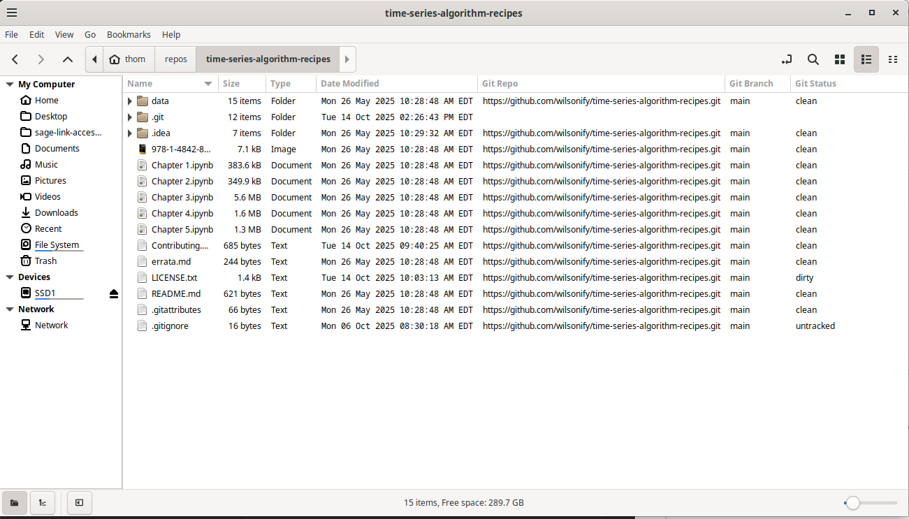

nemo-git-integration
=====

Integrate Git directly into the Nemo file explorer using context menus.

This project brings Git functionality into Nemo, the file manager used in the Cinnamon (a GNOME Files fork, formerly Nautilus) desktop environment. 

It lets you perform common Git operations via right-click, without opening a terminal or IDE.


# Get Started 

Ensure you're running **Debian** with **Cinnamon** as your window manager and **Nemo** as your file explorer.

```
make install    # Copies *.nemo_action files to the ~/.local/share/nemo/actions folder
make uninstall  # Removes installed actions
```

1. use debian as your operating system. probably works with red hat but it is not tested.  

2. use cinnnamon as you windows manager  

3. use nemo as your file explorer.
   
5. copy all *.nemo_action files to your ~/.local/share/nemo/actions or ```make install``` as mentioned above.

6. Zenity is used for graphical dialogs. if you don't have it then you can install it with apt ```sudo apt install zenity```
 
7. nemo-python is used for nemo extension columns. if you don't have it then you can install it with apt ```sudo apt install nemo-python```


# Usage

Each action is accessed by right-clicking files or folders in Nemo.

# Nemo Extension to display git status as a column 



## Project Structure

```
.
├── icons/                 # PNG icons and README for visual enhancements
├── nemo/                 # Contains .nemo_action files for context menu integration
│   └── actions/          # Each file corresponds to a specific Git operation
├── nemo-git-integration/ # Backing scripts grouped by CRUD-like categories
│   ├── s01-create/       # Scripts for repo creation (init, clone, branch)
│   ├── s02-read/         # Scripts for reading repo state (status, log, fetch)
│   ├── s03-update/       # Scripts for updating (pull, add, commit, push)
│   └── s04-delete/       # Scripts for undoing changes (reset, uninit, etc.)
├── tests/                # Bats-compatible test scripts for integration logic
├── makefile              # Install/uninstall .nemo_action files
├── LICENSE               # Licensing information
└── README.md             # This documentation
```

## Features

### 1. Create

- **Git Init:** Initialize a folder as a Git repository.
- **Git Clone:** Clone a remote Git repository.
- **Git Branch:** Create and switch to a new branch.

### 2. Read

- **Git Status:** Show the working tree state.
- **Git Log:** View recent commits.
- **Git Fetch:** Sync from remote without merging.

### 3. Update

- **Git Pull:** Merge remote changes into local branch.
- **Git Add:** Stage selected files.
- **Git Commit:** Commit staged changes.
- **Git Push:** Push changes to remote.

### 4. Delete/Undo

- **Git Reset:** Undo changes in working directory.
- **Git Uninit:** Remove .git directory.
- **Git Unclone:** Delete cloned repo.
- **Git Unbranch:** Delete local branch.
- **Git Unpull/Unadd/Uncommit/Unpush:** Roll back operations.


# How to Contribute

Contributions are welcome! If you want to contribute to this project, follow these steps:

1. Open an Issue so that it can be discussed in the open.
2. Fork this repository.
3. Create a new branch for your feature
4. Make your changes
5. commit them
6. Push them
7. Submit a pull request from your remote into my remote

## Testing

Scripts under `tests/` use [Bats](https://github.com/bats-core/bats-core) for shell testing. Each test corresponds to a script under `nemo-git-integration/`.

```bash
make dev # installs bats
make test # bats tests/*
```


# Action Syntax Cheatsheet

Some useful nemo_action stuff to help understand the code

%P: This placeholder represents the full path to the directory containing the selected file or folder. This ensures that the command navigates to the correct directory before executing the Git command.

%F: This represents the full path to the selected file.

%N: This represents the filename without the path, useful for commit messages.

## valid Selection(s)

s: Action is available when only one item is selected.

m: Action is available when multiple items are selected.

a: Action is available when one or more items are selected.

f: Action is available when files are selected.

d: Action is available when directories are selected.

You can combine these values to create more specific conditions. For example:

af: Action is available when one or more files are selected.

ad: Action is available when one or more directories are selected.

adf: Action is available when one or more directories or files are selected.

# Explanation

"$1" is the path to the current directory (%P in .nemo_action).

"$@" handles the selected files (%F in .nemo_action).

Uses zenity --question to confirm reset, which is destructive.

Aggregates errors to show at the end if anything failed.

## Run Nemo in Debug Mode

see nemo --help for more details
```
NEMO_DEBUG=Actions,Window nemo --debug
```


