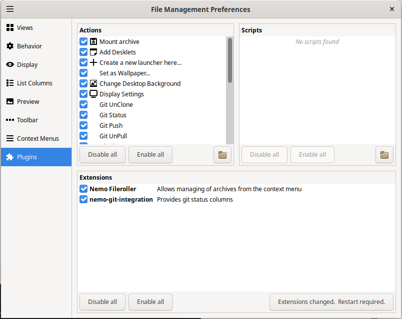

Administrator Guide
=====

This guide covers administrative tasks, system setup, and configuration for **Nemo Git Integration**.

---

## System Requirements

- **Operating System:** Debian-based Linux (tested on Linux Mint Debian Edition)  
- **Window Manager:** Cinnamon  
- **File Manager:** Nemo (>= 5.6.4)  
- **Dependencies:**
  - `git` – version control system
  - `zenity` – provides graphical dialogs
  - `nemo-python` – provides Nemo Python extension support

# Install dependencies

```bash
sudo apt-get update
sudo apt-get install -y git zenity nemo-python
make install
```

# Updates

Use the provided Makefile for re-installation and updates:

```
make uninstall   # Removes installed actions
make install     # Copies *.nemo_action files and scripts to correct locations
```

# Verify Installation

Ensure the following directories and files exist:

ls ~/.local/share/nemo/actions/
ls ~/.local/share/nemo-python/extensions/

In Nemo, enable or disable extension via:  

**Edit → Plugins**

You should see **Nemo Git Integration** (or `nemo-git-status`) in the extension list.



Enable the extension in Nemo:

    Open Nemo → Edit → Plugins

    Enable Nemo Git Integration
    
    
Restart Nemo

```
nemo -q
nemo &
```

## More Resources

- [Building & Installation](developer/building.md) - Full build and packaging instructions
- [User Guide](user.md) - End-user installation and usage

## Configuration

Git User Identity

Many scripts perform Git commits;

ensure Git is configured in the CI/user environment:

```
git config --global user.name "Name"
git config --global user.email "name@example.com"
```

For per-repo configuration:

```
cd /path/to/repo
git config user.name "Repo Admin"
git config user.email "repo@example.com"
```

Logging & Cache

Temporary cache files for branch state are stored in:

~/.cache/nemo_git_prev_branch
~/.cache/nemo_git_current_branch

Zenity logs can be captured for debugging:

export ZENITY_LOG=~/zenity_debug.log

## Advanced CI Setup

For automated testing in GitHub Actions:

Configure Git user in the workflow:

# Troubleshooting

| Issue                                                                                    | Resolution                                                                             |
|------------------------------------------------------------------------------------------|----------------------------------------------------------------------------------------|
| Scripts not visible in Nemo                                                              | Verify nemo-python installed and files exist in ~/.local/share/nemo-python/extensions/ |
| Git commands fail in scripts                                                            | Check Git user identity (git config) and permissions                                   |
| Zenity dialogs fail                                                                      | Ensure zenity is installed and executable in $PATH                                     |
| CI tests fail  | Make sure the CI runner sets Git user/email and HOME environment correctly |

- **scripts not visible**:  
  Ensure `nemo-python` is installed and the scripts files exist in the correct directory:

```bash
ls ~/.local/share/nemo-python/extensions/
```
