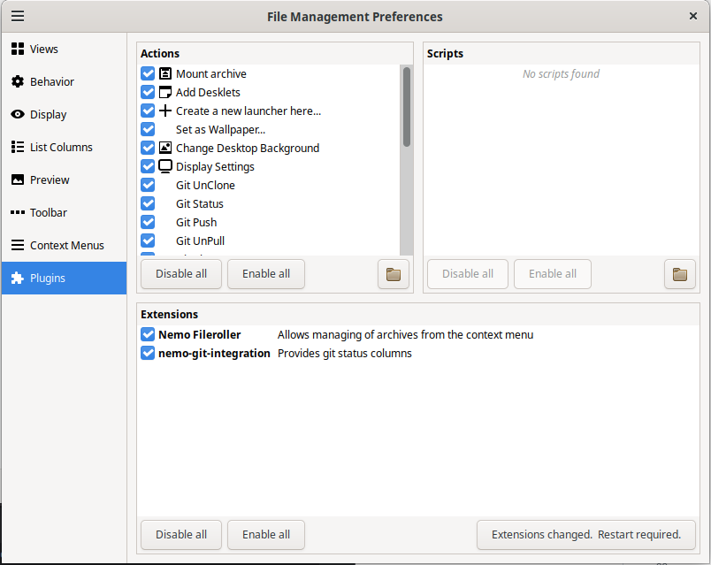

# Nemo Git Integration scripts

This extension is designed for the **Nemo File Manager**. 

It provides additional columns in the **List View** related to the Git status of files.

---

## Requirements

- **Nemo** (>= 5.6.4)  

- **nemo-python**

```bash
sudo apt-get install nemo-python
```

---

## Installation

Run the top-level installation script from the repository root:

```bash
./install.sh
```

This script will copy the Python script to `~/.local/share/nemo-python/extensions/`
If Nemo doesn’t restart automatically, you can manually restart it:

```bash
nemo -q && nemo &
```

---

## Managing the extension

In Nemo, enable or disable extension via:  

**Edit → Plugins**

You should see **Nemo Git Integration** (or `nemo-git-status`) in the extension list.



---

## Troubleshooting

- **scripts not visible**:  
  Ensure `nemo-python` is installed and the scripts files exist in the correct directory:

```bash
ls ~/.local/share/nemo-python/extensions/
```

- **Schema errors**:  
  Verify the schema XML is installed in `/usr/share/glib-2.0/schemas/` and recompile schemas:

```bash
sudo glib-compile-schemas /usr/share/glib-2.0/schemas/
```

- **Missing dependencies**:  
  Install any required development packages (e.g., `libglib2.0-dev`) if building or extending Nemo scripts.

---

## References

- [Ask Ubuntu: How to install Nemo scripts?](https://askubuntu.com/questions/824719/how-to-install-nemo-scripts)  
- [Nemo scripts on GitHub](https://github.com/linuxmint/nemo-scripts)

